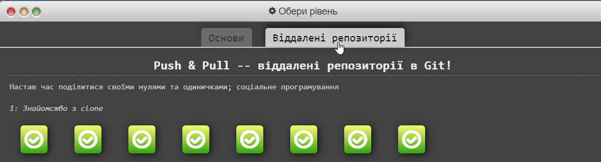

# kottans-frontend
Репозиторій для навчального курсу від kottans

___
# Stage_0

 - [x] **Git, GitHub, git flow**
 - [x] **Linux, командний рядок, основи нетворкінгу**
 - [ ] **HTML, CSS**
 - [ ] **JS basics**
 - [ ] **Frontend framework basics (React)**
 - [ ] **TypeScript basics**

___

## **Level 0:** Introduction to git (git-intro)

1.Рівні на [Coursera](https://www.coursera.org/learn/introduction-git-github): 

2.Рівні на [learngitbranching.js.org](http://learngitbranching.js.org)

3. Репозиторій `kottans-frontend` створиу)

4. Успішний Pull request в `mock-repo` [туть](https://github.com/kottans/mock-repo/pull/761)

5. Заключення:
- Раніше багато чув про git та github, але зберігав раніше все просто в себе на диску і не більше. Також в новинку користування Markdown.
- Детально ознайомившись з цією благодаттю під назвою Git, зрозумів на скільки це потужна штука.
- Вся інформація, з якою я ознайомився дуже сильно мені допоможе в подальшому

**P.S.** learngitbranching це як холодний душ. Хороший мозковий штурм для початківця в Git:D

## Linux CLI, and HTTP

 В цьому розділі, я: 
 - Пройшов [Linux Survival (4 Modules)](https://linuxsurvival.com/linux-tutorial-introduction/)

Linux Survival screens

---

Раніше вже працював з linux bash, так що особливо нових знань не набув, але було цікаво освіжити память) В подальшому і дальше буду їх використовувати.

- Прочитав дві статті про HTTP протоколи, їх роботу та можливості. Поглибив свої знання в цьому питанні, та сподіваюсь, запамятав їх)
- Також пройшовся по додатковим матеріалам.

## Git для командної співпраці

В цьому розділі я:

 - Пройшов 3 та 4 тиждень курсу [Coursera](https://www.coursera.org/learn/introduction-git-github)
 

Скріншоти

- Пройшов Рівні на [learngitbranching.js.org](http://learngitbranching.js.org)

Скріншоти

Від себе хочу сказати, що курси на Courseera дали мені більше розуміння Git, ніж learngitbranching. В Courseera показують використання Git в реальних умовах, на відміну від learngitbranching. Хоч я його пройшов з тяжкістю, але пройшов, хоч прийшлось дуже багато раз заходити в підсказки. Тому поставив в закладки додаткові матеріали, і буду проходити по них для більшого розуміння Git:)

___

## **Level 0:** Front-End Basics

> З базою Front-End трішки ознайомлений, тому ця частина має пройти чудово)