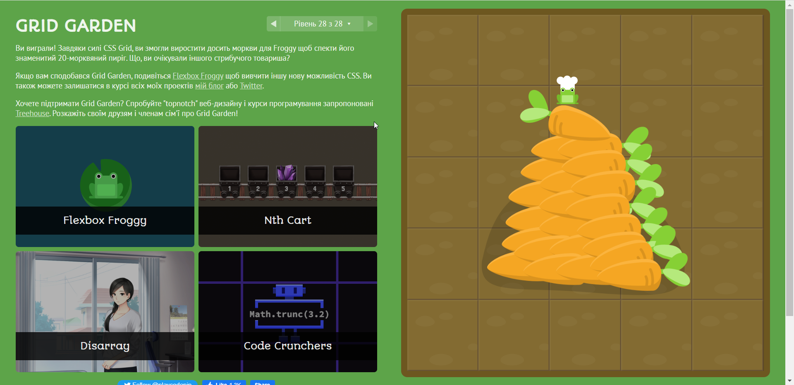

# kottans-frontend
Репозиторій для навчального курсу від kottans

___
# Stage_0

 - [x] **Git, GitHub, git flow**
 - [x] **Linux, командний рядок, основи нетворкінгу**
 - [ ] **HTML, CSS**
 - [ ] **JS basics**
 - [ ] **Frontend framework basics (React)**
 - [ ] **TypeScript basics**

___

## **Level 0:** Introduction to git (git-intro)

1. Рівні на [Coursera](https://www.coursera.org/learn/introduction-git-github): 

Скріншоти

2. Рівні на [learngitbranching.js.org](http://learngitbranching.js.org)

Скріншоти

3. Репозиторій `kottans-frontend` створиу)

4. Успішний Pull request в `mock-repo` [туть](https://github.com/kottans/mock-repo/pull/761)

5. Заключення:
>Раніше багато чув про git та github, але зберігав раніше все просто в себе на диску і не більше. Також в новинку користування Markdown.

>Детально ознайомившись з цією благодаттю під назвою Git, зрозумів на скільки це потужна штука.

>Вся інформація, з якою я ознайомився дуже сильно мені допоможе в подальшому

**P.S.** learngitbranching це як холодний душ. Хороший мозковий штурм для початківця в Git:D

___

## Linux CLI, and HTTP

 В цьому розділі, я: 
 - Пройшов [Linux Survival (4 Modules)](https://linuxsurvival.com/linux-tutorial-introduction/)

Linux Survival screens

>Раніше вже працював з linux bash, так що особливо нових знань не набув, але було цікаво освіжити память) В подальшому і дальше буду їх використовувати.

>Прочитав дві статті про HTTP протоколи, їх роботу та можливості. Поглибив свої знання в цьому питанні, та сподіваюсь, запамятав їх)
Також пройшовся по додатковим матеріалам.

___

## Git для командної співпраці

В цьому розділі я:

 - Пройшов 3 та 4 тиждень курсу [Coursera](https://www.coursera.org/learn/introduction-git-github)
 

Скріншоти

- Пройшов Рівні на [learngitbranching.js.org](http://learngitbranching.js.org)

Скріншоти

> Від себе хочу сказати, що курси на Courseera дали мені більше розуміння Git, ніж learngitbranching. В Courseera показують використання Git в реальних умовах, на відміну від learngitbranching. Хоч я його пройшов з тяжкістю, але пройшов, хоч прийшлось дуже багато раз заходити в підсказки. Тому поставив в закладки додаткові матеріали, і буду проходити по них для більшого розуміння Git:)

___

## **Level 0:** Front-End Basics

> З базою Front-End трішки ознайомлений, тому ця частина має пройти чудово)

## Intro to HTML and CSS

В цьому розділі я:
- Прослухав тижні 1 та 2 курсу [Intro to HTML & CSS](https://www.coursera.org/learn/html-css-javascript-for-web-developers)

Скріншоти

> Так як я вже ознайомлений з базами HTML CSS, пройшовся по курсу швиденько, освіживши знання. Спочатку віднісся до нього трішки скептично, але частина про CSS дуже добре пропрацьована. Лектор детально пояснює всі нюанси, так що це чудово. Трішки освіжив знання про media запити та в загальному чудово, що є такі класні ресурси безкоштовно)

- Пройшов курси від CodeAcademy про HTML і CSS

Скріншоти

> Курси від CodeAcademy дуже схожі з FreeCodeCamp, які раніше я теж проходив, для новачка самий раз, так як, якщо ти десь застряг, вони тобі вкажуть куди треба тикнути, хоч може це і їхня проблема теж. Але в загальному все чудово, пробігся швиденько)

>Знання, які здобув та пригадав на цьому розділі і дальше буду використовувати в повсякденному навчанні)

## Responsive Web Design

В цьому розділі я:

1. Прочитав дуже корисну статтю про [Responsive web design basics](https://web.dev/i18n/en/responsive-web-design-basics/) 
>Дуже толкова стаття, яка нарешті розкриває мені всі нюанси тегу `<meta viewport>` Освіжив всі свої знання в цьому

2. Переглянув плейлист відеозаписів [FLEXBOX. Вчимося верстати на флексах](https://www.youtube.com/playlist?list=PLM6XATa8CAG5mPV60dMmjMRrHVW4LmV2x) 
>Знаю цей канал ще до курсу, дуже крутий хлопець, і він українець, який перейшов на українську після початку війни, за що йому окреме дякую! Освіжив память про Flexbox та буду використовувати це в подальшому)

3. Пройшов гру [Flexbox Froggy](http://flexboxfroggy.com/)

Скріншоти

>З флекбоксами знайомий, підтягнув знання)

4. Пройшов [Grid Garden](http://cssgridgarden.com/)

Скріншоти

>Теж знаю цю технологію, детально досліджую методи її використання в майбутньому.

>У цьому розділі пригадав знання з Responsive Web Design. Буду застосовувати на практиці)

## HTML і CSS практика: Hooli-style Popup

Виконав практичне завдання, в якому потрібно було створити простий навбар з випадаючим попапом. Використовуючи тільки **HTML** і **CSS**.

[Demo](https://serentinos.github.io/html-css-popup/) |
[Code base](https://github.com/serentinos/html-css-popup) | 
[Approved PR](https://github.com/kottans/frontend-2022-homeworks/pull/125)

Взагалі це був цікавий виклик, адже ніколи до цього не верстав інтерактивні елементи. В цьому проекті попап з'являється через активацію прихованого чекбокса, що дуже цікаво. Реалізацію підглянув з відео на ютубі, яке було прикріплене в курсі. 

